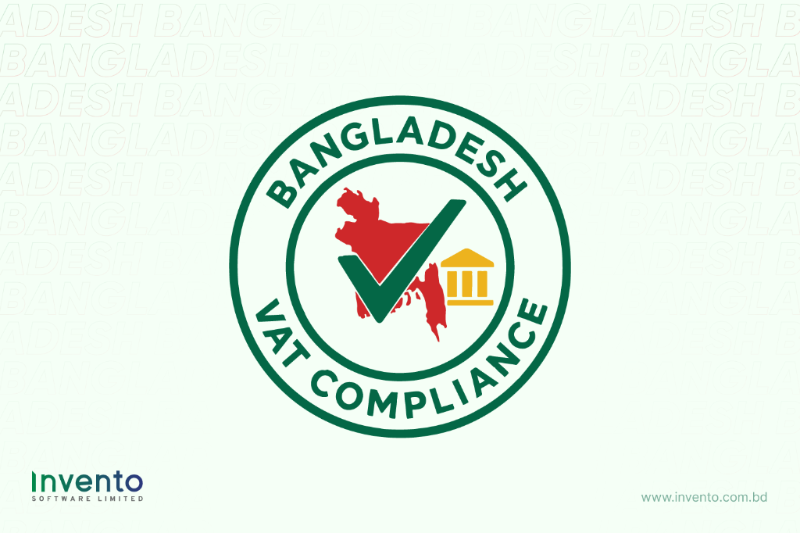
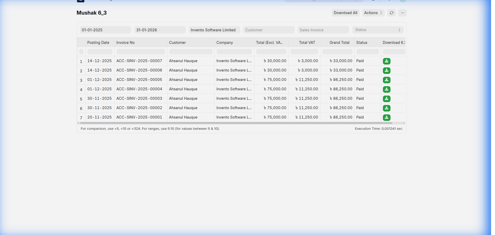
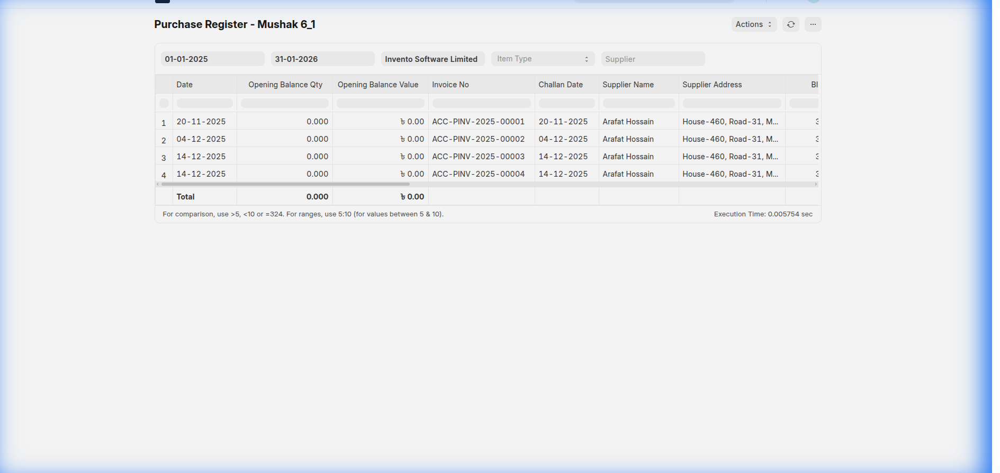
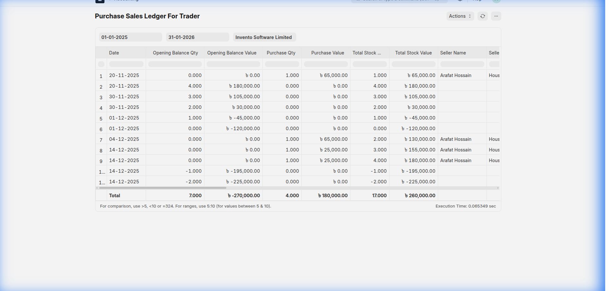
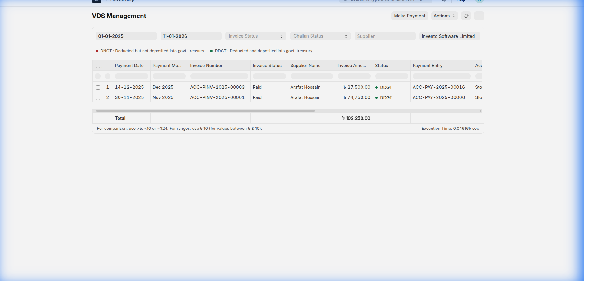
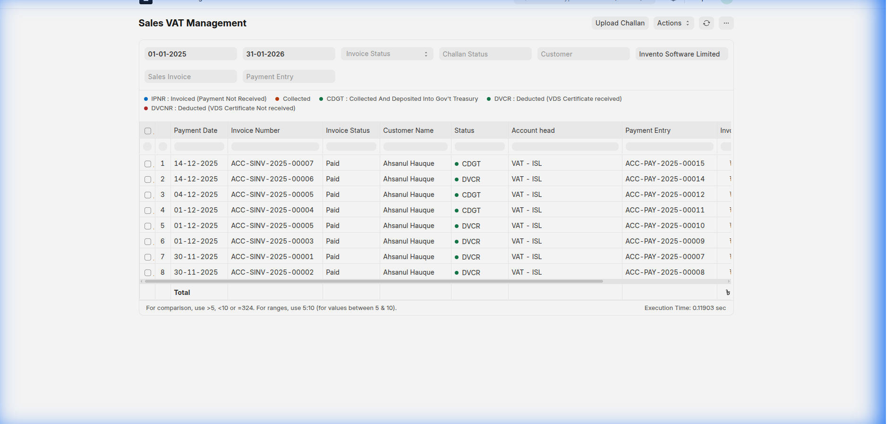
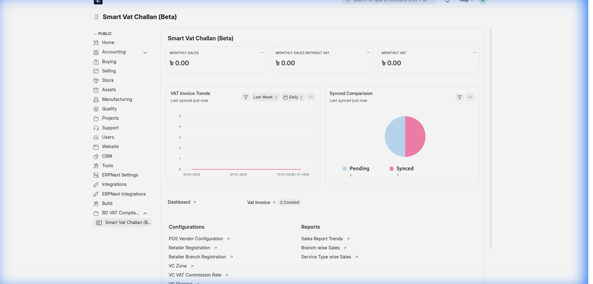

# Simplify Your Business with the Bangladesh VAT Compliance App

Navigating **Value Added Tax (VAT)** compliance in Bangladesh is more than a routine accounting task—it is a high‑risk, documentation‑intensive obligation governed by strict **National Board of Revenue (NBR)** regulations. From issuing compliant tax invoices to preparing Mushak reports under tight deadlines, even small discrepancies can trigger audits, penalties, or delayed refunds.

**Bangladesh VAT Compliance** for **Frappe** and **ERPNext** is built to eliminate that risk. The app automates your entire VAT lifecycle, embeds compliance directly into daily operations, and ensures your business stays aligned with current NBR requirements—without spreadsheets, duplicate entry, or last‑minute stress.

---

## Who Is This App For?

This solution is designed for Bangladeshi businesses that must manage VAT accurately and transparently:

- **Manufacturers** managing input tax, production, and output VAT
- **Traders & Distributors** handling high‑volume purchase–sales registers
- **Service Providers** operating under service VAT structures
- **ERPNext users** migrating from spreadsheets or legacy VAT tools
- **Businesses registered under VAT & VDS** obligations

If your finance team spends days preparing Mushak reports every month, this app is built for you.

---

## Why VAT Compliance Is So Challenging in Bangladesh

Bangladesh’s VAT system is intentionally documentation‑driven. Compliance requires more than issuing invoices—it demands accurate, real‑time tracking of:

- Purchase and sales registers
- Input tax credit eligibility
- HS codes and statutory declarations
- **VDS (VAT Deducted at Source)** certificates and treasury deposits
- Monthly reconciliation across multiple Mushak formats

Many organizations still rely on spreadsheets to manage this complexity. This approach is slow, error‑prone, and risky—especially during audits or return submissions.

**Bangladesh VAT Compliance** transforms VAT from a manual afterthought into a structured, automated system embedded directly inside ERPNext.

---

## Key Features: A Complete VAT Compliance Suite

Our features are organized to mirror your real‑world workflow—from daily transactions to statutory reporting.

---

## 1. Core Mushak Suite (Statutory Reports)

Generate NBR‑compliant Mushak reports automatically from your operational data—no double entry required.

### Automated Mushak 6.3 (Tax Invoice)

Generate fully compliant VAT Tax Invoices instantly, including HS Codes, VAT rates, and statutory declarations as per NBR format.

**Outcome:**
- Eliminates manual invoice formatting
- Ensures every sales invoice is audit‑ready

---

### Real‑Time Registers: Mushak 6.1 & 6.2

Your **Purchase Register (Mushak 6.1)** and **Sales Register (Mushak 6.2)** update automatically with every transaction.

**Outcome:**
- Accurate input tax credit calculation
- Zero reconciliation gaps during audits

---

### Purchase–Sales Ledger (Mushak 6.2.1)

Designed especially for traders, this report provides a consolidated view of inventory movement and VAT liability.

**Outcome:**
- Clear visibility into VAT impact across stock flow
- Faster month‑end closing

---

## 2. Advanced VAT & VDS Management

Go beyond reporting with operational controls that protect cash flow and compliance.

### Efficient VDS Management

Track VAT Deducted at Source from suppliers and generate **Mushak 6.6** certificates instantly. Monitor treasury deposits and offsets without spreadsheets.

**Outcome:**
- Prevents missed VDS credits
- Reduces supplier reconciliation disputes

---

### Sales VAT Management

Monitor output VAT liabilities and treasury deposit status in one centralized view.

**Outcome:**
- Ensures timely VAT payments
- Reduces penalty and interest risk

---

## 3. Smart VAT Challan Integration (Beta) 🚀

The app now integrates seamlessly with the **NBR Smart VAT system**, reducing manual interaction with government portals.

### Smart VAT Challan Features

- **Secure API Integration** with NBR systems
- **Automated Master Data Sync** (Zones, Circles, Service Types)
- **One‑Click Challan Generation** with PDF/XML downloads

**Outcome:**
- Faster treasury submissions
- Fewer data‑entry errors

---

## Built for Trust, Accuracy, and Longevity

- Designed based on **current NBR VAT & Mushak guidelines**
- Built natively for **ERPNext & Frappe Framework**
- Open‑source transparency via GitHub
- Actively maintained with regulatory updates in mind

> *Compliance logic is configurable to adapt as NBR regulations evolve.*

---

## Product Roadmap & Future Vision

We are committed to long‑term VAT compliance automation in Bangladesh.

Planned enhancements include:

- **Automated Mushak 9.1** monthly VAT return generation
- **Direct NBR API submission** for returns and challans
- **Advanced VAT analytics dashboards** for CFO‑level insights

This ensures your compliance system grows alongside regulatory changes.

---

## Get Started Today

Turn VAT compliance from a recurring burden into a streamlined operational advantage.

**Bangladesh VAT Compliance** is available on the **Frappe Cloud Marketplace**.

👉 **Install Now:** https://cloud.frappe.io/marketplace/apps/vat_compliance

🔍 **Source Code & Documentation:** https://github.com/invento-software-limited/vat_compliance

📞 **Request a Demo:** Contact us to see how the app fits your business workflow.

---

### Frequently Asked Questions

**Is this app NBR‑approved?**  
The app follows published NBR VAT and Mushak formats. Final responsibility for submission remains with the taxpayer.

**Does it support service VAT and VDS?**  
Yes. Both service VAT and VDS workflows are supported.

**Can it replace spreadsheets completely?**  
Yes. All statutory registers and reports are generated directly from ERPNext transactions.

---

*Bangladesh VAT Compliance — Built for accuracy. Designed for confidence.*
