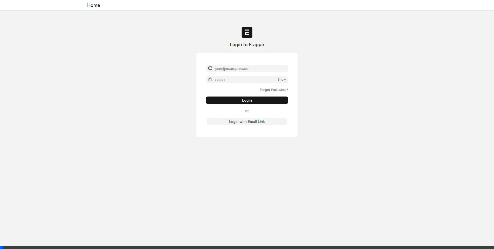
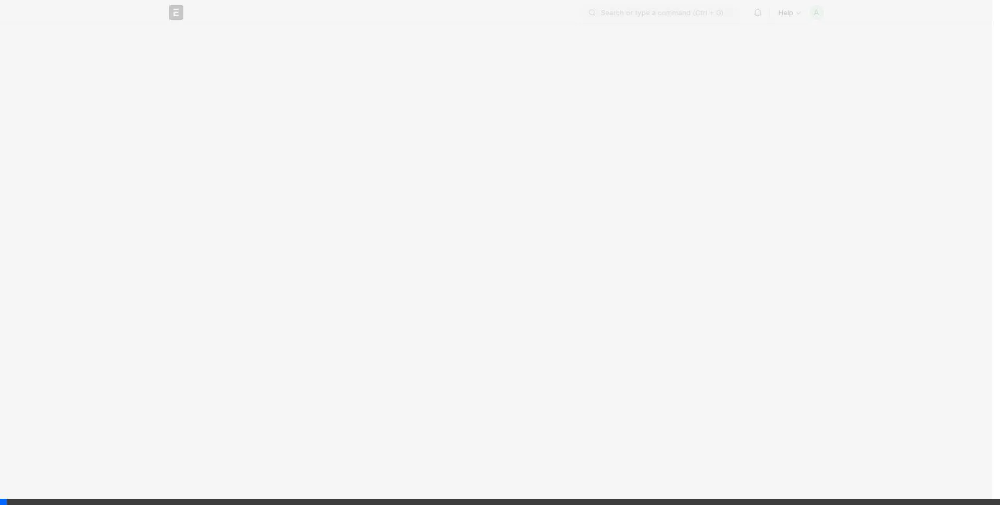
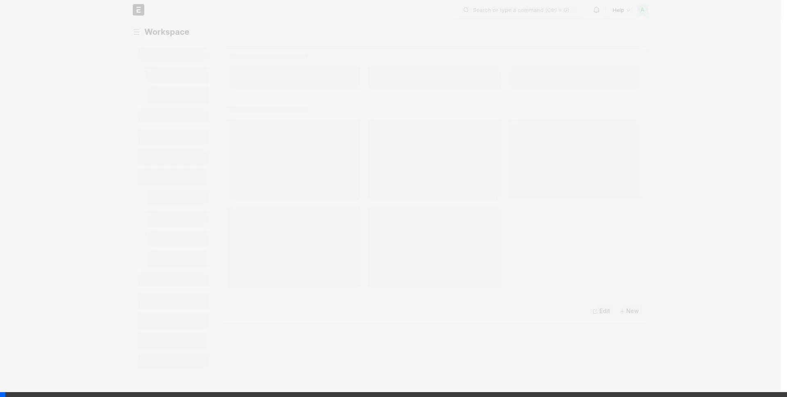
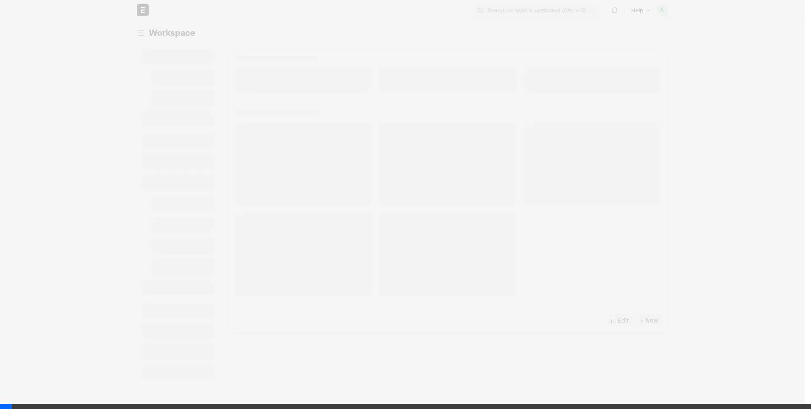
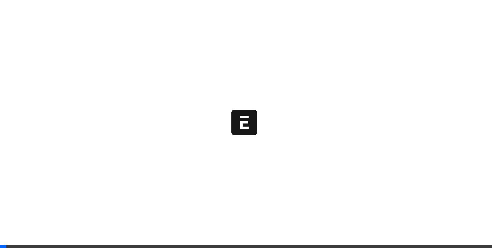

# 📖 Bangladesh VAT Compliance - User Guide

## 🏁 Getting Started
Before you begin, ensure you have completed the onboarding steps to configure the system for VAT compliance.

### 🚀 Onboarding Steps

1.  **Setup Item Tax Template**: Define tax templates for your items (e.g., VAT 15%, VAT 5%).
2.  **Create an Item**: Add your products or services to the Item master.
3.  **Configure Item Tax Template In Item**: Assign the appropriate tax template to each item.

## 🛒 Sales Workflow

### 1. Creating a Sales Invoice 🧾

When creating a Sales Invoice, you will notice additional fields tailored for VAT compliance.
-   **Vehicle Details 🚛**:
    -   **Vehicle**: Link a vehicle record if applicable.
    -   **Vehicle Number**: Enter the license plate number.
    -   **Vehicle Type**: Specify the type of vehicle.
-   **Print Format 🖨️**: The default print format is set to **Mushak 6.3**. Ensure this is selected to generate the compliant VAT Challan.

### 2. Receiving Payment 💰
When recording a payment against a Sales Invoice using **Payment Entry**:
-   **VDS/VCS Selection**: You must select whether the VAT was:
    -   **Withheld**: The customer deducted the VAT at source.
    -   **Collected**: You collected the VAT from the customer.
-   **Document Attachments 📎**: You can attach supporting documents directly in the Payment Entry.
    -   **Document Type**: Select from Challan, Voucher, Money Receipt / Cheque, or Others.
    -   **File**: Upload the document.
    -   **Challan Info**: If 'Challan' is selected, enter Date, Amount, No, and Branch/Bank details.

## 🛍️ Purchase Workflow

### 1. Creating a Purchase Invoice 🧾

Create Purchase Invoices as usual, ensuring that the correct Item Tax Templates are applied to calculate VAT accurately.

### 2. Making Payment 💸
Record payments to suppliers using Payment Entry. Similar to sales, you can manage VDS status and attach relevant documents.

## 📊 Compliance Reports
The data entered in Sales and Purchase workflows directly feeds into the following compliance reports.

### Sales VAT Management

This report is your central hub for monitoring Sales VAT liability.
-   **Workflow**:
    1.  **Invoice Created**: Status is 'Invoiced (Payment Not Received)' (**IPNR**).
    2.  **Payment Received (Collected)**: Status becomes 'Collected'.
    3.  **Payment Received (Withheld)**: Status becomes 'Deducted (VDS Certificate Not received)' (**DVCNR**).
    4.  **Challan Uploaded**: If status is **DVCNR**, select the row and click **Upload Challan** to attach the VDS certificate. Status changes to 'Deducted (VDS Certificate received)' (**DVCR**).
-   **Key Filters**: Invoice Status, Challan Status, Customer.
-   **⚡ Actions**:
    -   **📤 Upload Challan**: This button becomes visible when you select rows with the status **DVCNR** (Deducted, VDS Certificate Not Received). Clicking it opens a dialog where you can upload the VDS certificate received from the customer. Once uploaded, the system updates the status of the selected invoices to **DVCR** (Deducted, VDS Certificate Received) and links the uploaded document to the transaction.

### VDS Management

Manage VAT Deduction at Source (VDS) for your purchases.
-   **Workflow**:
    1.  **Payment Made (Withheld)**: Status is 'Deducted Not Given to Treasury' (**DNGT**).
    2.  **Deposit to Treasury**: Select **DNGT** rows and click **Make Payment** to create a Journal Entry for depositing the withheld VAT to the government. Status changes to 'Deducted & Deposited to Govt Treasury' (**DDGT**).
-   **Key Filters**: Challan Status (DNGT/DDGT), Supplier.
-   **⚡ Actions**:
    -   **💳 Make Payment**: This button is active when you select rows with the status **DNGT** (Deducted, Not Given to Treasury). Clicking it initiates the process to deposit the withheld VAT to the government treasury. It automatically creates a **Journal Entry** for the total withheld amount from the selected transactions. Upon successful posting, the status updates to **DDGT** (Deducted & Deposited to Govt Treasury).

### VAT Payment Page

This page serves as a central console for managing your VAT liabilities. It consolidates data from **Sales VAT Management** (Collected VAT) and **VDS Management** (Withheld VAT) to help you make timely payments to the treasury.
-   **Purpose**: To view and pay all outstanding VAT liabilities in one place.
-   **Workflow**:
    1.  **Filter**: Select the **From Date**, **To Date**, and **Company**. Click **Refresh**.
    2.  **View Liabilities**: The table displays all **Collected** VAT from sales and **Withheld** VAT (DNGT) from purchases.
    3.  **Select & Pay**: Select the rows you wish to pay.
    4.  **Make Payment**: Click the **Make Payment** button.
-   **⚡ Actions**:
    -   **Make Payment**: Clicking this button creates a single **Journal Entry** for all selected rows, streamlining the payment process to the government treasury.

### Mushak 6.3 (VAT Challan)

Generate the official VAT Challan for your sales.
-   **Usage**: Select a Sales Invoice to view and print the Mushak 6.3 form.
-   **Features**: Use **Download All** to bulk download challans for a date range.
-   **⚡ Actions**:
    -   **📥 Download All**: This feature allows you to bulk download VAT Challans. Instead of printing them one by one, clicking this button generates a single PDF file containing the Mushak 6.3 forms for all Sales Invoices that match your current report filters (e.g., date range, customer).

### Registers & Ledgers
-   **Purchase Register - Mushak 6.1**: Detailed register of all purchases.
-   **Sales Register - Mushak 6.2**: Detailed register of all sales.
-   **Purchase Sales Ledger For Trader**: A combined ledger view for traders to track inventory and VAT.

### Supplier Mushak 6.3

-   **Usage**: Track if suppliers have provided the Mushak 6.3 form.
-   **Workflow**: If status is 'Not Collected', use the **Upload** button to attach the Mushak 6.3 file received from the supplier.
-   **⚡ Actions**:
    -   **📤 Upload**: Use this button when you receive the Mushak 6.3 form from a supplier. Select the rows with status **Not Collected** and click **Upload**. You can then attach the digital copy of the form. This action updates the status to **Collected**, helping you track compliance for your purchases.

## 📦 Reference

### VAT Deduction Certificate
-   **Purpose**: Issue certificates for VDS deductions.
-   **Key Fields**: Certificate Type (Treasury Payment/VAT Return), Vendor, Period (From/To Date), Posting Date.

### Document Attachment
-   **Purpose**: A utility doctype to store compliance documents (Challans, Vouchers) with metadata like Challan No, Date, and Amount. Used within Payment Entries.
